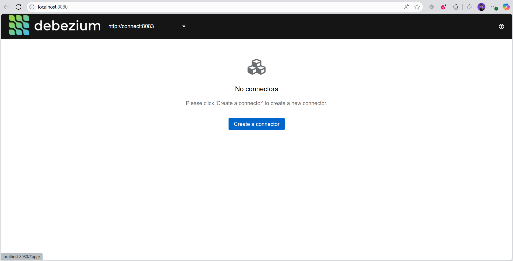

# Run
> This project is inspired by this [YusukeKishino/debezium-rails-sample](https://github.com/YusukeKishino/debezium-rails-sample)
```
$ docker compose up --build
```

# Add a new connection
You can use the Debezium UI web app on the port 8080 (not very good app honestly :/)



I prefer making the connection request manually

>By default the connection starts on `snapshot.mode` => `inital`
>
> `initial`: Takes a snapshot of the structure and data of captured tables. Useful if topics have to be populated with a complete representation of the data from the captured tables.


```bash
curl --location --request POST 'localhost:8083/connectors/' --header 'Accept: application/json' --header 'Content-Type: application/json' --data-raw '{
    "name": "your-debezium-connection-name",
    "config": {
        "connector.class": "io.debezium.connector.postgresql.PostgresConnector",
        "tasks.max": "1",

        "database.hostname":    "your-hostname",
        "database.port":        "5432",
        "database.user":        "user",                
        "database.password":    "password",
        "database.dbname":      "dbname",
        "database.server.name": "localhost",            

        "plugin.name": "pgoutput",
        "topic.prefix": "your-kafka-topic-prefix",
        "snapshot.mode": "no_data",
        "schema.include.list": "public",

        "transforms": "unwrap",
        "transforms.unwrap.type": "io.debezium.transforms.ExtractNewRecordState",
        "transforms.unwrap.drop.tombstones": "true",
        "transforms.unwrap.delete.handling.mode": "drop"
    }
}'
```

# Consume the messages

Debezium will send the messages to the topics following the custom prefix the database schema (by default is public)
 and the data table that triggered the change 

Example
```
topic "my-topic.public.posts"
```


# Images

```
REPOSITORY                  TAG      SIZE
postgres                    16       451MB
docker-smaia-vpn            latest   16.5MB
debezium/connect            2.6      1.35GB
debezium/debezium-ui        latest   467MB
confluentinc/cp-kafka       7.5.0    849MB
confluentinc/cp-zookeeper   7.5.0    849MB
```

# In Karafka
This example does not intend to explain how to setup and config Karafka with the current setup service in the docker-compose.yml.
To learn more about Karafka please refer to the [docs](https://karafka.io/docs/)

```ruby
# karafka.rb

class KarafkaApp < KarafkaBase
  consumer_groups.draw do
    topic "my-topic.public.posts" do
      consumer Debezium::Consumer
    end
  end
end
```

```ruby
class ApplicationConsumer < Karafka::BaseConsumer
  def consume
    messages.each { |message| execute(message) }
  end
end
```

```ruby
# app/consumers/debezium/consumer.rb

class Debezium::Consumer < ApplicationConsumer
  def execute(message)
    payload = message.payload

    payload['payload']['op']

    # op    Value	  Description	  Corresponds to
    #  c	  Create	  INSERT        log
    #  u	  Update	  UPDATE        log
    #  d	  Delete	  DELETE        log
    #  r	  Read      (snapshot)	  Snapshot data
  end
end
```
